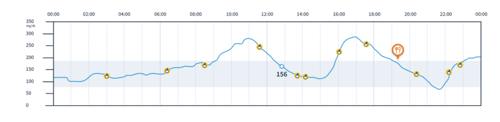

## BÀI TEST 20240219

## EX 1: Giải thuật
Cho liên kết đơn: x1 -> x2 -> x3 -> ... -> xn
Hãy tìm thuật toán để chuyển thành:
x1 -> xn -> x2 -> xn-1 -> x3 -> ... 
>(Thuật toán có chi phí càng thấp thì điểm càng cao)

## EX 2: Giả sử ta có 1 table như sau trong MySQL server:
+---------------------------+
|   wikipedia_article       |
+---------------------------+
|   id integer,             |
|   title varchar(255)      |
|   cat_id integer          |
|   lang integer            |
|   last_update datetime    | 
|   created_date datetime   |
+---------------------------+
> Giả sử ta đã download và xử lý toàn bộ database của Wikipedia tiếng Anh, Nhật, Ý, Tây Ban Nha, Pháp, Đức, … và lưu các giá trị cần thiết vào table này. Sau khi lưu xong, table có 6 triệu bản ghi (6 triệu records hay rows). 
> Giả sử máy tính chạy MySQL server là localhost có RAM 4GB, còn trống 256MB.
> Để lấy tất cả bản ghi từ database và thực hiện một số xử lý, một lập trình viên (A) đã làm như sau:
```python
    numRowSet = mysql_query( “SELECT COUNT(id) FROM wikipedia_article” );
    nRows = numRowSet[0][“Count(id)”];	// get number of rows in the table
    nProcessed = 0; // number of processed rows
    while( nProcessed < nRows ) {
        strQuery = “SELECT * FROM wikipedia_article LIMIT   ”
        strQuery += nProcessed  +  “,  20” ;
        recordSet = mysql_query( strQuery );
        nArticles = mysql_num_rows( recordSet ); // get number of rows
        // process all rows received from the query result
        for( i = 0; i < nArticles; i++ )
            processs_article( recordSet[i] );
        nProcessed += nArticles;
    }
```
> Cho biết hàm process_article chỉ lưu lại một vài tham số kiểu nguyên (ví dụ tổng chiều dài của các title) nên hoàn toàn không tiêu tốn bộ nhớ, chương trình chạy ngay trên localhost (cùng host với MySQL server). Khi chạy đoạn chương trình trên, lập trình viên nhận thấy thời gian chạy là 1 ngày.
> Một lập trình viên khác (B) cũng làm việc xử lý tương tự nhưng chương trình của lập trình viên B đó chỉ tốn khoảng 20 phút để xử lý toàn bộ các bản ghi.
> a) Hãy giải thích tại sao chương trình của A lại chạy chậm như vậy?
> b) Hãy viết mã giả cho chương trình của lập trình viên B.


## EX 3: Tạo giao diện hiển thị biểu đồ theo yêu cầu sau:
Trong đó:
> - Biểu đồ đường: dữ liệu đường huyết theo thời gian (hba1c)
> - Icon hình quả táo: thời gian ăn bữa phụ trong ngày
> - Icon hình đĩa: thời gian ăn bữa chính trong ngày




Dữ liệu mẫu: (ứng viên tự random dữ liệu hba1c trong ngày từ 06:00-23:59 hàng ngày, biểu đổ cần thể hiện hết các thời điểm chứa bữa ăn trong ngày)

```json
    {
        "hba1c": [
            {
            "time": "09:00",
            "value": 100
            },
            {
            "time": "09:15",
            "value": 105
            },
            {
            "time": "09:30",
            "value": 130
            },
            {
            "time": "09:45",
            "value": 125
            },
            {
            "time": "10:00",
            "value": 102
            }
        ],
        "sub_meals": [
            "09:04",
            "11:23",
            "15:44",
            "21:33"
        ],
        "primary_meals": [
            "12:05",
            "19:10"
        ]
    }
```
